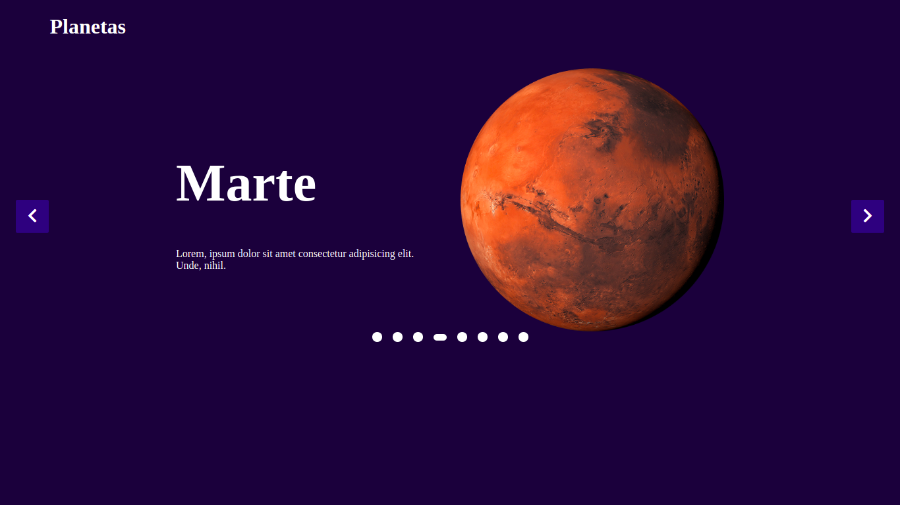

<h1 align="center">
 Slider
</h1>


<h1 align="center">
    
</h1>


<br>

## 🧪 Technologies

This project was developed using the following technologies:

- JavaScript
- CSS

## 🚀 Getting started

Clone the project and access the folder.

```bash
$ https://github.com/Luis-Felipe-N/slide.git
$ cd slide
```


The app will be available for access on your browser at http://127.0.0.1:5500/index.html


## 📝 License

This project is licensed under the MIT License. See the [LICENSE](LICENSE.md) file for details.


---

<p align="center">Made with 💛 by Luis Felipe</p>